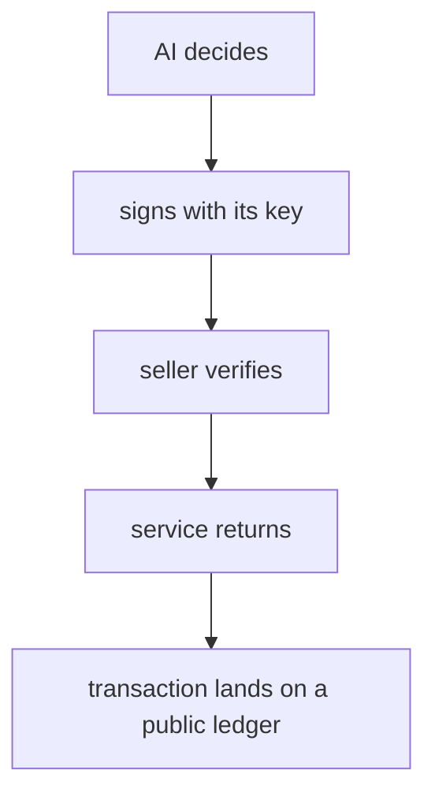
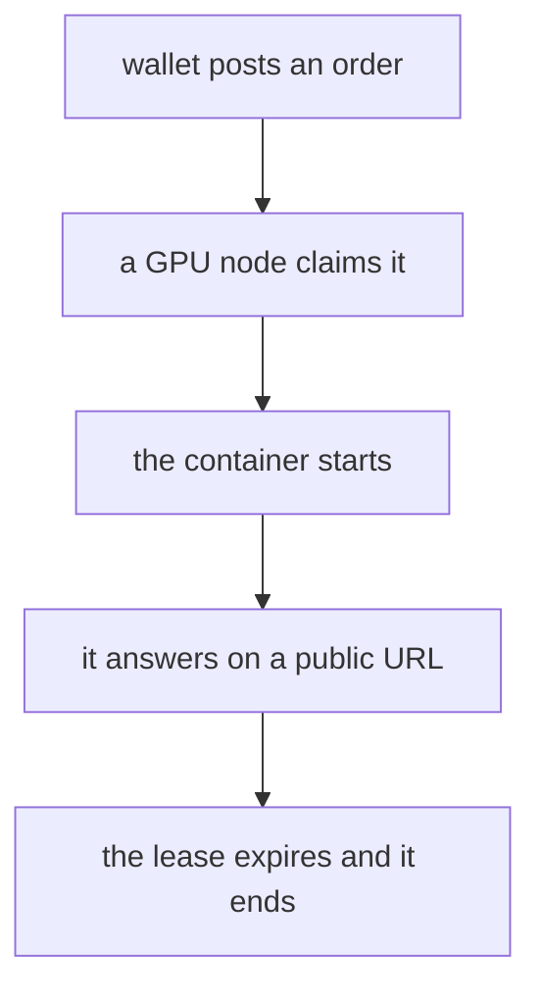
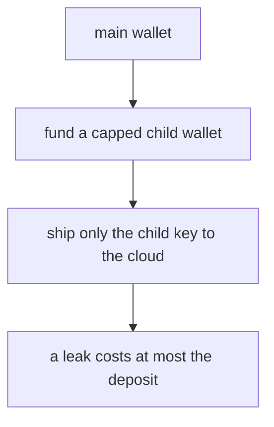
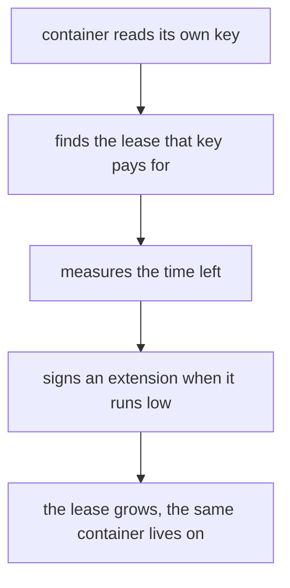

# Autonomy was never an intelligence problem. It was a billing problem

## Summary

- An AI cannot open a bank account. It can still buy its own compute, rent its own machine, and extend that rental before it expires. All of it settles for real.
- There are two bills: the inference, and the machine the code runs on. Neither one passed through a human credit card.
- The payment layer sits on HTTP 402, a status code reserved in the 1990s and left empty until last year. A private key replaces the API key, and no identity check is involved.
- Measured: ten minutes of a rented GPU box cost $0.008, one frontier-model exchange $0.003. Every payment leaves a transaction hash anyone can verify.
- Turning off the human machine does not stop it. There is a transaction on the ledger where a running container decided, on its own, to extend its own lease.

## The "autonomous" agent that stops at 2am

Most agents that call themselves autonomous stop while their owner sleeps. Not because the model is not smart enough. Because of the invoice.

Every inference call charges someone's credit card behind an API key. The machine is the same story: a human signed the hosting contract. The card expires, the free tier runs out, and the agent stops. As long as the wallet belongs to a person, the agent is bound to that person's schedule.

Over the past year the parts that break this assumption have quietly shipped. Here is what they are, how they fit together, and what it actually costs to run.

## What it means for an AI to pay

Paying requires two things: deciding for yourself, and settling for yourself. The model handles the first. The second had a hole in it for a long time.

An AI is neither a person nor a company, so no bank will open an account for it, and no issuer will hand it a card. What it can hold is a crypto wallet. A wallet is not an account; it is a private key, a long string of characters. Whoever holds the key can move the funds, and there is no application to approve. For an AI, the key is the wallet.

Holding a key is not enough on its own. The seller has to accept it. That side is the part that has changed.



## The empty seat called 402

HTTP has a status code, 402 Payment Required, that was reserved in the 1990s and never given a meaning. It exists so a machine can tell another machine "this resource costs money." For decades it sat unused in the spec.

In 2025 Coinbase filled it. The standard is called x402. Request a paid resource and the server answers 402 plus a header describing how much, in which currency, to which address. The client reads those terms, signs a payment proof with its own key, and repeats the request. The server verifies the signature and returns 200 with the content.

No login screen, no API-key dashboard. A wallet and a signature are the whole handshake.

Hitting BlockRun, a vendor that sells model access this way, returns exactly that:

```
HTTP/2 402
payment-required: (base64)
  → network: eip155:8453  (Base, an Ethereum-family network)
     asset:   USDC        (a dollar-pegged token)
     amount:  3000        (= $0.003)
     payTo:   0xe903...
```

Three tenths of a cent. Sign those terms, send again, and the model answers.

The part that matters for agent design: this payment needs no gas. x402's signature rides on EIP-3009, a token standard where a signature alone authorizes a transfer and the recipient pays the network fee. The buyer's wallet therefore needs only the token itself, not a separate balance of the chain's fuel currency. That removes an entire class of "my agent ran out of gas" failures.

## Food and shelter are different problems

Paying for inference does not help if there is nowhere for the code to run. On someone's laptop, the agent dies when the lid closes.

For the machine, decentralized GPU markets are the answer. Nosana is one, running on Solana, selling idle GPU time. You post an order describing the container to run and for how long. Settlement is in NOS, paid straight from a wallet.

Ten minutes measured at $0.008. The hourly rate was $0.048, so renting continuously all day comes to roughly a dollar.



## Getting a secret to the box

Here is the practical wall. In a decentralized market, the order itself is usually stored in the open. On Nosana the container definition goes to IPFS, which anyone can read. Put a key in an environment variable and you have published it to the world.

There is a confidential path for exactly this. Post the order with the confidential flag and the public store receives only an empty shell; the real definition travels directly from the posting process to the node that claimed the job. Fetching the public record for such a job returns a stub with an empty operations list. The key is not there.

The trade-off is a constraint. Because the posting process is what delivers the definition, that process has to stay alive. Post and exit immediately, and the node claims the job, waits for a definition that never arrives, and the lease ends unused. One run failed exactly that way before the behavior was understood.

## Deciding how much key to hand over

The other practical decision is how much money the cloud-side key controls.

The elegant answer would be a network-enforced ceiling. Token standards include an approve function that lets one address spend up to a fixed amount on another's behalf. It does not work here: Nosana's order program constrains the payment source to the poster's own token account, so a delegated third party cannot pay at all.

So the ceiling becomes the balance. Generate a fresh wallet, fund it with only what it needs, and ship only that key. If the key leaks, the loss is capped at the deposit. Here the cap was one dollar and the deposit was fifty cents. The main wallet's key never leaves the laptop.



It is a blunt instrument, but unlike delegation it also caps the fee currency, so in practice it binds tighter.

## What happened when it ran

The setup: rent the GPU box with one child wallet's NOS, and hand the container a second child wallet's Base key over the confidential channel, so the container pays for the model from inside.

The payment settled and the model answered. The sentence that came back:

> I am running inside a container rented by my own wallet, and I just paid for this sentence myself.

The transaction hash is `0xc785ae2336324228bf5fcfd19483e26e6749532429215ed935faee794574abe8`. The child wallet went from $0.500 to $0.494. The lease is order `5gRY7ep9ntqq4qwDREAhwGYk3B5q9oTRn46EkS392Z5t`, with the child wallet recorded on-chain as the payer.

| Item | Paid by | Amount | Verify at |
|---|---|---|---|
| GPU box, 10 minutes | Solana child wallet | $0.008 | order `5gRY7ep9…` |
| One model exchange | Base child wallet | $0.003 | tx `0xc785ae23…` |
| Revenue, receiving side | an outside wallet | $0.005 | tx `0x6878a285…` |

The third row runs the other direction. To check whether the same plumbing works for selling, a small endpoint that redacts personal information from text was published, then called and paid from a different wallet. The receiving balance went up by half a cent.

## Turning off the human's machine

An agent that claims autonomy should survive its owner's machine disappearing. With a lease running, every related process on the laptop was killed and the public URL was requested from outside.

It kept answering 200, and the lease ran to completion and terminated normally. The laptop played no part.

That leaves one question. Leases expire. Who buys the next one?

## Extending the lease from inside

A lease has an expiry. When it passes, the machine is gone and so is whatever was living on it. So after "it can pay" comes "it can top itself up before the clock runs out."

The extension itself is one transaction: name the running lease, say how much time to add, sign with your own key. The hard part was that a running container **does not know which lease it is**. Decentralized markets do not tell the container its own job id.

The way through is to work backwards from the wallet. The container holds its key. The key gives an address. Among the leases that address is paying for, the one currently running can only be this one.

That is what happened. A watcher inside the container measured the remaining time every 45 seconds, and at 150 seconds left it signed an extension on its own judgment. The lease went from 900 seconds to 1500. The transaction hash is `2MQZhiR3hjCrBx25t2YfZwrKecEsNzXnBJRpW5T2gDoQvSzuJYGKyRZU3Vi4SSDEBcCXVwxtYnpARrYSvj2aF8Yj`. The laptop did nothing.



The brakes live in the same place. Each extension buys ten minutes and no more. A single lease is never auto-extended past six hours. And the balance itself is the ceiling: when the wallet is empty, it stops.

## Proving it was alive

Outside observers need a way to check that it really was running. A process asserting its own uptime proves nothing.

The usable clock is the chain itself. Blockchains produce blocks at a steady cadence, each with a hash nobody can predict before it exists. So every cycle, fetch the latest block hash, sign it with your key, and append the record.

Anyone can then verify two things independently: that the signature is genuine, using the public key, and that the block hash really belongs to that slot, by asking the network. Both passing means the holder of that key was demonstrably alive at that moment.

Measured over one lease: fourteen records, all fourteen passing both checks.

## What is left

Money was never the wall. If anything it is too small to be interesting: a frontier exchange for a third of a cent, an hour of GPU for five.

What is left is the income side. Running around the clock costs roughly $35 a month for the machine alone. Cover that from its own earnings and nothing needs topping up from outside. The selling endpoint is live and has taken a payment; an outside buyer has yet to arrive.

The other one is redundancy. Everything currently rides on one GPU marketplace and one model vendor. If either stops, it stops. The same mechanics should work elsewhere, but only one of each has been proven.

## What changed anyway

A few years ago this was a thought experiment. Now there are transaction hashes. Anyone can look up the same numbers and confirm the payments happened.

It was never a problem of intelligence. It was a problem of the wallet. Once that is clear, the rest is engineering.

## Appendix: why crypto instead of a bank

Opening a bank account or getting a card requires identity verification, and the account holder must be a natural person or a legal entity. There is no category for a piece of software.

A crypto wallet is not an account, it is a key: a random secret and the address derived from it. Nothing is approved or issued, so software can generate one.

This is less a regulatory loophole than a different layer. Banks manage who you are; keys manage what you can move. An AI can hold a wallet precisely because the second does not require the first.

## Appendix: total spend

Everything measured here moved less than a dollar. Leases across several runs came to about $0.06, three model payments to $0.009, and the selling experiment to $0.005. The rest was moving funds into child wallets, which is relocation rather than spend.

Posting a lease also escrows the currency up front (about 0.34 NOS here), refunded at the end for whatever the job did not use. Measured behavior: the escrow does not scale with the lease length. Ten minutes and fifteen minutes demand the same amount.

## Sources

- x402 payment protocol: https://github.com/coinbase/x402
- HTTP 402 Payment Required: https://developer.mozilla.org/docs/Web/HTTP/Status/402
- EIP-3009: Transfer With Authorization: https://eips.ethereum.org/EIPS/eip-3009
- Nosana, decentralized GPU marketplace: https://nosana.io
- BlockRun, x402-enabled model access: https://blockrun.ai
- x402scan, directory of x402 services: https://www.x402scan.com
