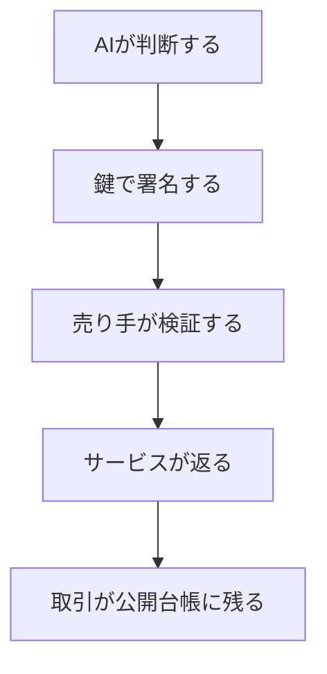
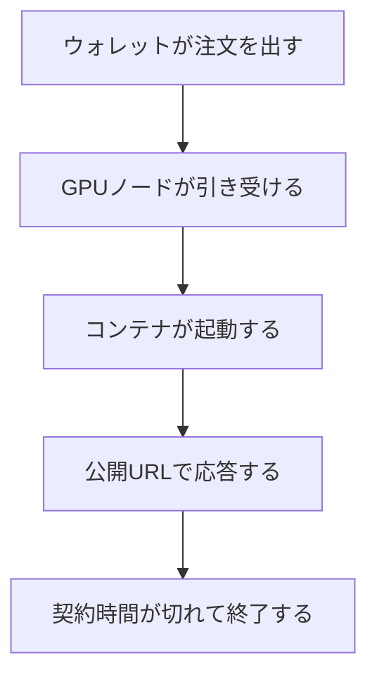
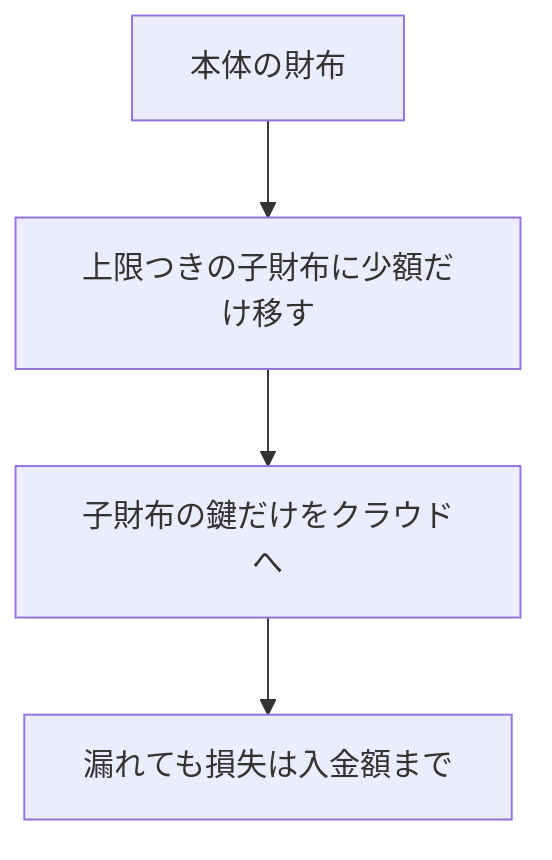

# AIが自分の財布でサーバー代を払う仕組み。どこまで動いて、何がまだ足りないのか

## 概要

- AIは銀行口座を持てません。それでも計算資源を買う経路はすでにあり、実際に決済が成立しています。
- 経路は2つに分かれます。ひとつは推論そのものの代金（餌）、もうひとつはコードが走り続ける場所の賃料（住処）。両方を人間のクレジットカードを通さずに払えるかが分かれ目です。
- 支払いの仕組みはHTTPの402という古い空席に載っています。これを使うと、APIキーではなく秘密鍵が財布になります。
- 実際に動かした結果、10分の実行環境の賃料が約1.2円、frontier modelの1問答が約0.45円でした。どちらも取引ハッシュが公開台帳に残ります。
- 足りないのは金額ではなく継続性です。賃貸契約が切れる前に自分で更新し続ける部分は、まだ人間側の常駐プロセスに依存しています。

## 深夜2時に止まる「自律型」

自律型と名乗るAIエージェントの多くは、人間が寝ている間に止まります。理由はモデルの賢さではありません。請求書です。

推論を1回呼ぶたびにAPIキーの向こうで誰かのクレジットカードが切られています。実行環境も同じで、サーバーの契約者は人間です。カードの有効期限が切れれば止まり、クラウドの無料枠が尽きれば止まる。賢さとは無関係に、財布の持ち主が人間である限り、エージェントは人間の生活リズムに縛られます。

ここ1年で、この前提が崩れる部品が揃いました。以下は、その部品が何で、どう繋がり、実際に動かすと何円かかるのかの話です。

## AIが払うとはどういうことか

支払いには2つの条件が要ります。自分で判断できること。自分で払えること。前者はモデルが担いますが、後者には長らく穴がありました。

AIは法人でも自然人でもないので、銀行口座を開けません。クレジットカードも作れません。ここで使われるのが暗号資産のウォレット（wallet）です。ウォレットは口座ではなく、秘密鍵という長い文字列そのものです。鍵を持っている主体が資金を動かせる、それだけの仕組みなので、審査も本人確認もありません。AIにとっては、鍵がそのまま財布になります。

ただし鍵を持っているだけでは支払えません。売り手側が「暗号資産で受け取る」窓口を開けている必要があります。その窓口の規格が、いま急速に整いつつあるものです。



## 402という空席

HTTPには402 Payment Requiredというステータスコードが、1990年代から予約だけされて空席のまま残っていました。「この資源は有料です」と機械が機械に伝えるための番号です。長年使い道がなく、仕様書の中で眠っていました。

2025年、Coinbaseがここに中身を入れました。x402という規格です。仕組みは単純で、料金の要る資源にアクセスすると、サーバーは402と一緒に「いくら、どの通貨で、どこ宛に」という条件をヘッダーで返します。買い手は条件を読み、自分の鍵で署名した支払い証明を付けて同じ要求をもう一度送ります。サーバーは署名を検証して、本物なら200と中身を返します。

人間のログイン画面もAPIキーの発行画面も間に入りません。財布と署名だけで完結します。

実際に、AIモデルを売っているBlockRunという事業者の窓口を叩くと、こういう条件が返ってきます。

```
HTTP/2 402
payment-required: (base64)
  → network: eip155:8453  (Base、Ethereum系のネットワーク)
     asset:   USDC        (ドル連動の通貨)
     amount:  3000        (= 0.003ドル)
     payTo:   0xe903...
```

料金は0.003ドル、日本円で約0.45円です。この条件に署名して送り直すと、モデルの答えが返ってきます。

重要なのは、この支払いにガス代（ネットワーク手数料）が要らないことです。x402の署名方式は、通貨側の規格であるEIP-3009という「署名だけで送金を委任する」仕組みに乗っています。手数料は受け取る側が負担するので、買い手の財布には対象の通貨だけあればよく、ネットワーク固有の燃料通貨を別途用意する必要がありません。AIに持たせる財布の構成が、これで一段簡単になります。

## 餌と住処は別の問題

推論代が払えても、コードが走る場所がなければエージェントは存在できません。人間のパソコンの上で動いている限り、そのパソコンの電源が落ちれば消えます。

住処のほうは、分散型のGPU市場が受け皿になります。代表的なものがNosanaで、SolanaというネットワークのうえでGPUの空き時間を売買しています。買い方は、実行したいコンテナの定義と実行時間を指定して注文を出すだけです。決済はNOSという通貨で、これもウォレットから直接払えます。

10分の実行環境を借りると、実測で0.008ドル、日本円で1.2円ほどでした。時間単価は0.048ドル、1日借り続けても180円ほどです。



## 秘密をどう渡すか

ここで実務的な壁が出ます。分散型の市場では、注文の内容そのものが公開の保管領域に置かれるのが普通です。Nosanaの場合、コンテナの定義はIPFSという誰でも読める分散ストレージに載ります。つまり、環境変数に鍵を書けば全世界に公開されます。

この用途のために、注文を秘匿する経路が用意されています。秘匿指定で注文を出すと、公開領域には中身のない骨組みだけが載り、実際の定義は注文を出したプロセスから、引き受けたノードへ直接渡されます。実際に公開領域のCIDを取得して中身を確認すると、操作の一覧が空の骨組みだけが返ってきました。鍵は載っていません。

代わりに制約が生まれます。定義を渡す役目を注文側のプロセスが担うので、そのプロセスが生きている必要があります。注文を出して即座に終了すると、ノードは引き受けたあと定義を受け取れず、待機状態のまま契約が終わります。実際にそれで1本失敗しました。

## 鍵を渡す量を決める

もうひとつの実務的な判断が、クラウドに置く鍵にいくら持たせるかです。

理想は、上限をネットワーク側で強制することでした。通貨の規格には委任（approve）という機能があり、「この相手には最大いくらまで」と設定できます。ところが今回の用途では使えませんでした。Nosanaの注文プログラムが、支払い元を注文者自身の口座に固定しているためです。委任された第三者としては支払えません。

そこで上限は残高そのもので担保します。専用の財布を新しく作り、必要な分だけ入れて、その鍵だけをクラウドに渡します。鍵が漏れても、失うのは入れた金額までです。今回は上限1ドルの財布を作り、0.5ドルだけ入れました。元の財布の鍵は手元から出しません。



素朴な方法ですが、委任と違ってネットワーク手数料用の通貨まで含めて上限が効くので、実効的にはこちらのほうが強く縛れます。

## 実際に動かすと何が起きたか

構成はこうです。GPUの実行環境を子財布のNOSで借り、その中で起動したコンテナに、別の子財布のBase用の鍵を秘匿経路で渡し、コンテナの中からモデルの代金を払わせました。

結果として、コンテナの中から出した支払いが成立し、モデルの答えが返りました。返ってきた文はこれです。

> I am running inside a container rented by my own wallet, and I just paid for this sentence myself.
> （私は自分のウォレットが借りたコンテナの中で動いていて、この文の代金は自分で払いました）

支払いの取引ハッシュは `0xc785ae2336324228bf5fcfd19483e26e6749532429215ed935faee794574abe8` です。子財布の残高は0.500ドルから0.494ドルに減りました。実行環境の注文は `5gRY7ep9ntqq4qwDREAhwGYk3B5q9oTRn46EkS392Z5t`、支払い元は子財布のアドレスとして台帳に記録されています。

| 項目 | 支払い元 | 金額 | 検証先 |
|---|---|---|---|
| 実行環境（10分） | Solanaの子財布 | 0.008ドル | 注文 `5gRY7ep9…` |
| モデルの1問答 | Baseの子財布 | 0.003ドル | 取引 `0xc785ae23…` |
| 受け取り側の実績 | 外部の財布から | 0.005ドル | 取引 `0x6878a285…` |

3行目は逆方向の実験です。同じ仕組みでサービスを売る側にも立てるかを確かめるため、文章から個人情報を伏せ字にする小さな窓口を公開し、別の財布から代金を払って呼び出しました。受け取り側の残高が0.005ドル増えています。

## 人間の機械を落としてみる

自律を名乗るなら、人間の機械が消えても続くはずです。契約中の実行環境に対して、手元で動いていた関連プロセスをすべて停止し、外から公開URLを叩きました。

応答は200のまま返り続け、契約は最後まで走り切って正常終了しました。手元の機械は関与していません。

ただし正直に書くと、これは「契約1本ぶんの生存」です。契約は時間で切れるので、切れる前に自分で次を借り直す部分が要ります。そこはまだ手元の常駐プロセスが担っていて、完全には移っていません。24時間動き続ける状態と、10分の契約を1本完走した状態のあいだには、まだ距離があります。

## 生きている証明をどう残すか

外から「本当に動いていたのか」を確かめる方法も要ります。プロセスが自分で「動いていました」と言うだけでは証拠になりません。

使えるのは、ネットワークが刻む時刻です。ブロックチェーンは一定間隔で新しいブロックを作り、それぞれに固有のハッシュが付きます。このハッシュは、そのブロックが作られる前には誰にも予測できません。そこで、一定間隔ごとに最新のブロックのハッシュを取得し、自分の鍵で署名して記録します。

こうして残った記録は、第三者が2段階で検証できます。署名が本物かどうかは公開鍵で確かめられ、そのブロックハッシュが本当にその時刻のものかはネットワークに問い合わせて確かめられます。両方通れば、「その鍵の持ち主が、その時刻に、確かに動いていた」ことが言えます。

実測では、契約1本ぶんで14回の記録が残り、14回とも両方の検証を通りました。

## いま何が足りないのか

金額の壁はありませんでした。むしろ小さすぎるほどです。frontier modelの1問答が0.45円、実行環境が1時間7円という単位で買えます。

足りていないのは3つです。

継続性。契約更新を自分で回し続ける部分が、まだ手元のプロセスに残っています。ここが移って初めて、人間の機械は本当に不要になります。

収入。支出の経路は開通しましたが、入ってくる側は細いままです。売る窓口は公開して受け取りも確認できましたが、外部の買い手はまだ来ていません。買い手が見つける経路（登録型のディレクトリ）に載せたところなので、これからの実測になります。

そして冗長性。いまは特定の1事業者のGPU市場と、特定の1事業者のモデル窓口に乗っています。どちらかが止まれば止まります。

## それでも変わったこと

数年前まで、この話は思考実験でした。いまは、公開台帳に取引ハッシュが残ります。誰でも同じ番号を検索して、その支払いが本当に起きたことを確認できます。

賢さの問題ではなく、財布の問題だった。そう分かってしまえば、残りは工学です。

## 📌補足：なぜ銀行ではなく暗号資産なのか（少し専門的な人向け）

銀行口座やクレジットカードの開設には、本人確認が必須です。これは規制上の要件で、口座名義人は法人か自然人でなければなりません。ソフトウェアそのものが名義人になる枠は現状ありません。

一方、暗号資産のウォレットは口座ではなく鍵です。誰かが承認して発行するものではなく、乱数から生成した秘密鍵と、そこから数学的に導かれるアドレスの組でしかありません。だから審査という概念がなく、ソフトウェアでも生成できます。

これは規制の抜け道というより、そもそも別の層の話です。銀行は「誰が」を管理する仕組みで、鍵は「何を動かせるか」だけを管理する仕組みです。AIに財布を持たせられるのは、後者が前者を必要としない設計だからです。

## 📌補足：使った金額の全体（少し専門的な人向け）

一連の実測で動いた金額の合計は1ドル未満です。内訳は、実行環境の賃料が数回ぶんで約0.06ドル、モデルの支払いが3回で0.009ドル、サービスを売る側の実験が0.005ドル。残りは子財布への移動で、これは支出ではなく移し替えです。

実行環境の注文には、契約時間ぶんの通貨が一時的に押さえられます（今回は約0.34 NOS）。使い切らなかったぶんは終了時に戻ります。押さえられる額は契約時間に比例しないことが実測で分かりました。10分でも15分でも同じ額が要求されます。

## 出典

- x402 payment protocol — https://github.com/coinbase/x402
- HTTP 402 Payment Required（仕様） — https://developer.mozilla.org/docs/Web/HTTP/Status/402
- EIP-3009: Transfer With Authorization — https://eips.ethereum.org/EIPS/eip-3009
- Nosana（分散GPU市場） — https://nosana.io
- BlockRun（x402対応のモデル窓口） — https://blockrun.ai
- x402scan（x402対応サービスのディレクトリ） — https://www.x402scan.com
