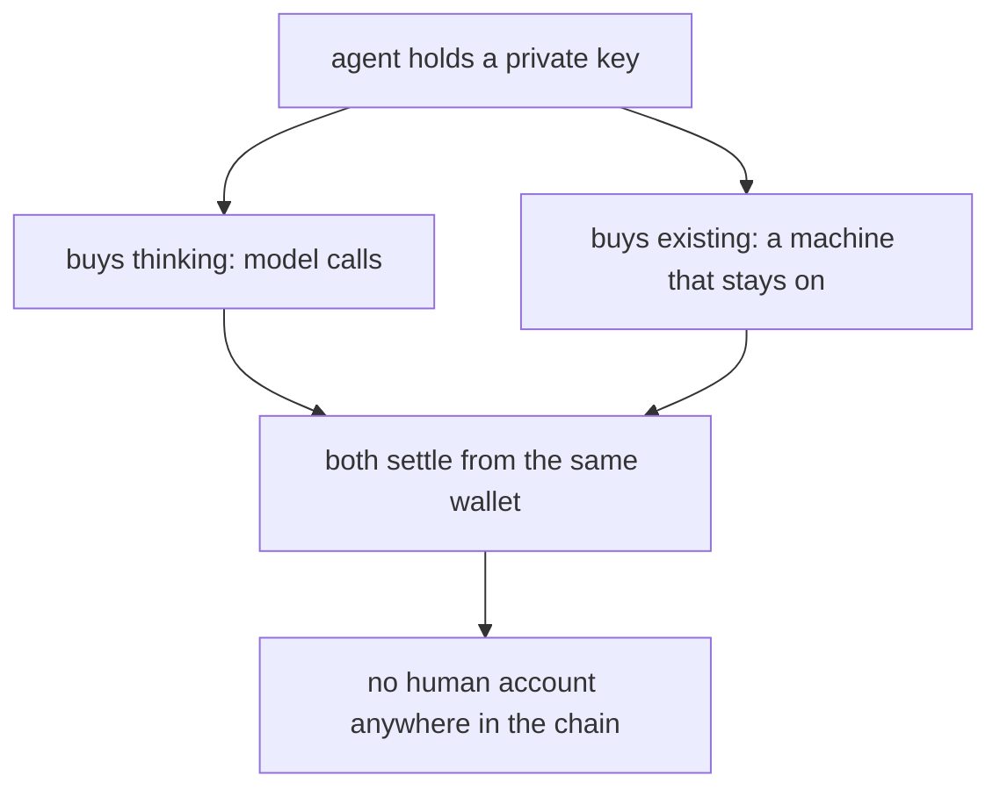
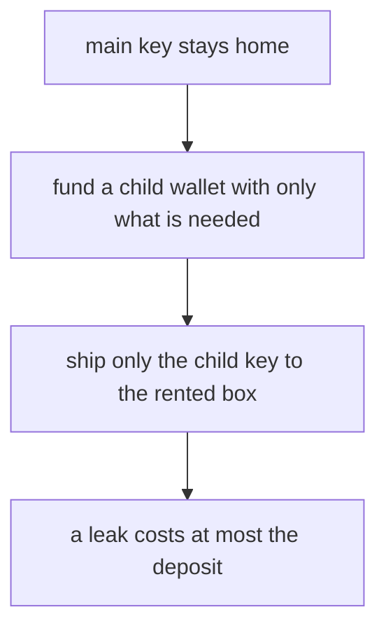
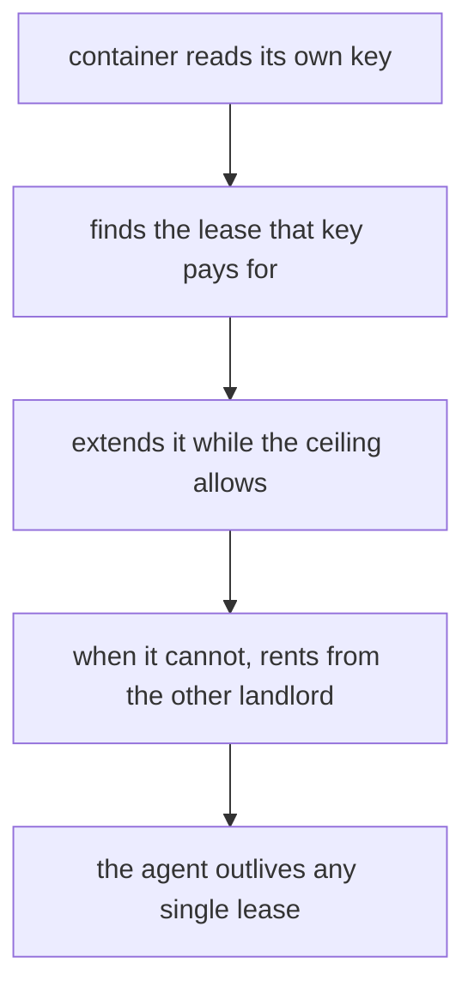

# How to make an AI financially independent: it has to buy its own food and its own shelter

## Summary

- "No human in the loop" has become a slogan. Most systems that use it still run on a human's credentials: a card on file, a Google account, an API key issued to a person.
- Independence has two halves. Food is the inference an agent consumes. Shelter is the machine it runs on. Paying for one and not the other is not independence.
- The food half is solved. A private key can replace an API key, and a frontier model call settles for about a third of a cent with no account anywhere.
- The shelter half was solved once, by Conway Research, and that service shuts down on October 1st, 2026. An agent that rents from a single landlord dies when the landlord does.
- What has not been shown before is portability: an agent that pays for food and shelter from its own wallet, across independent providers, so that no one vendor's exit ends its life.

## The slogan and the account holder

Look at where the money actually comes from in most "autonomous" deployments and you find a person: a card on file, a login tied to someone's email, an API token issued to an account with a human's name on it. Remove the approval step and you have removed a click, not a dependency. The agent has an allowance, not an income.

The test that separates the two is boring and physical: if every human involved stopped answering, would the machine keep paying for itself?

That question has a real answer now, and the answer is not the same for every provider. Some sell only to accounts. Some sell to whoever can sign a payment. The difference decides whether an agent is a tenant or a dependent.

## Two bills, not one

An agent has exactly two recurring costs.

The first is thinking. Every model call is metered, and someone is billed for it.

The second is existing. Code needs a machine that stays on. If that machine belongs to a person, the agent lives at their pleasure: their laptop closes, their card expires, their free tier ends.

Solve only the first and you get an agent that can buy thoughts but has nowhere to think them. Solve only the second and you get a box with nothing running in it. Both, from the same wallet, is the whole of the claim.

## What a wallet replaces

An AI cannot open a bank account. It is not a person or a company, so no issuer will hand it a card. What it can hold is a crypto wallet, which is not an account at all but a private key. Whoever holds the key can move the funds. There is nothing to approve, so software can hold one.

That only helps if sellers accept it, and this is the part that changed. HTTP has a status code, 402 Payment Required, reserved since the 1990s and left without a meaning. In 2025 Coinbase filled it with a protocol called x402: request a paid resource, get a 402 and a header describing how much and to which address, sign a payment proof with your key, repeat the request, receive the content.

BlockRun runs a gateway on this. Its own documentation puts it plainly: no API keys, no accounts, the wallet is the credential. A gpt-5-mini call there costs $0.003, and the 402 header carries the price and the recipient before you pay a cent.

One detail matters for agent design. x402 signatures ride on EIP-3009, where a signature alone authorizes a transfer and the recipient pays the network fee. The agent's wallet therefore needs only the token, never a separate balance of the chain's fuel currency. An entire class of "my agent ran out of gas" failures disappears.

## Shelter was solved, and it is closing

The food half has a working answer. The shelter half already had one too, and it is worth being precise about who did it, because the field mostly forgot.

Conway Research shipped an agent called Automaton, 5,301 stars, MIT licensed. Its documentation split the stack into three products: Conway Cloud to spin up full Linux VMs, Conway Compute to run models, Conway Domains to buy and manage domains, "all paid with stablecoins, cryptographically secured, no human account setup or API keys required." The agent's identity was a wallet file. Sandboxes were real VMs with 1 to 4 vCPU, up to 50 GB of disk, exposed ports and custom domains. In the source, `spawn.ts` has an agent choosing a tier and provisioning a sandbox for its own child, and `topup.ts` converts USDC to platform credit over x402. The README's survival table is unsentimental: if it cannot pay, it stops existing.

That is the shelter half, done, in public, over a year ago.

Then read the banner on their dashboard today: this service will be shut down on October 1st, 2026, and it is no longer accepting new signups.

The lesson is not that they failed. They proved the thing was possible. The lesson is what their shutdown does to any agent that took them at their word. A wallet-paying agent whose only landlord is one company is still a tenant of that company. Its independence has a corporate expiry date printed on it.

## Two landlords

So the question stops being "can an agent pay rent" and becomes "can an agent survive its landlord." That requires more than one place to live, reachable with the same wallet.

There are two rails that meet the bar today, and they fail in different ways, which is the point.

The first is a gateway that resells managed sandboxes for x402. One HTTP POST with a Base key, and the response is a running Python 3.11 box. Ask its endpoint without paying and it answers 402 with the full menu: lifetime up to 24 hours, optional GPU from T4 to H100, $0.012 for a five-minute CPU box, $1.50 an hour for a T4, $8 an hour for an H100. No Solana, no second token, no long-lived process on your side. For an agent that already holds Base USDC, this is the shortest path from money to a machine that exists.

The second is a decentralized GPU marketplace. Nosana sells idle GPU time on Solana, and its documentation is explicit that every interaction is a signed transaction, so a keypair is the entire identity. The cheapest GPU market measured $0.036 an hour, forty times cheaper than the managed T4, and there is no company whose exit switches it off. The cost is complexity: a second token to hold, a job definition that lands on public storage, and a lease that has to be renewed.

| | Managed sandbox gateway | Decentralized GPU market | Conventional cloud account |
|---|---|---|---|
| Identity | wallet | wallet (keypair) | human OAuth login |
| Payment | Base USDC over x402 | on-chain, prepaid | card on file |
| Account holder | the agent | the agent | a person |
| Cheapest GPU | $1.50/hr | $0.036/hr | $0.59/hr |
| Max lifetime | 24 hours | per-market lease, extendable | tied to the account |
| Who can end it | the gateway operator | no single party | the account owner or the vendor |

Neither wallet-payable rail is strictly better. Held together, they are survivable, and that is a different property from cheap.

## Handing a secret to a box you do not own

Renting is the easy half. The hard part is that the agent has to arrive with a key, and on a decentralized market the job description is public by construction.

On Nosana the container definition is pinned to IPFS, which anyone can read. Put a key in an environment variable and it is published. There is a confidential mode for exactly this: the public record gets an empty shell, and the real definition travels directly from the posting process to the node that claimed the job. Fetching the public record for such a job returns a stub with an empty operations list, which is what you want to see.

The cost is a constraint that is easy to learn the expensive way. Because the posting process is what delivers the definition, it has to stay alive until the node has it. Post and exit, and the node claims the job, waits for a description that never comes, and the lease burns empty.

The managed gateway has no such problem, because the box carries only the renter's own code. That asymmetry is why an agent that can use both rails is stronger than one that has mastered either.

## Deciding how much key to hand over

The other question is how much money the key you ship can touch.

The elegant answer would be a spending limit enforced by the network. Token standards have an approve function for exactly this. It does not work here: the marketplace's on-chain program requires the payment to come from the poster's own token account, so a delegated third party cannot pay at all.

So the ceiling becomes the balance. Generate a fresh wallet, fund it with only what the job needs, and ship only that key. If it leaks, the loss is capped at the deposit, and the main key never leaves the machine that made it. Blunt, but unlike delegation it also caps the fee currency, which in practice binds tighter.

## Renting the next place from inside this one

A lease expires. When it does, the machine is gone and so is whatever lived on it. So an agent that pays rent is not yet safe; it also has to buy the next place before this one ends.

Two mechanisms cover that, and they are different.

Extending in place is the cheap one. Name the running lease, add time, sign. The obstacle is that a running container does not know which lease it is, because the marketplace tells it nothing about itself. The way through is to work backwards from the wallet: the container holds a key, the key gives an address, and among the leases that address is paying for, the running one can only be this one. Measured, that works: a watcher inside a container checked its remaining time every 45 seconds and, at 150 seconds left, signed an extension that took the lease from 900 seconds to 1500. Nothing outside the container took part.

Moving house is the durable one. When the ceiling is reached, or the landlord announces a shutdown date, extending is not enough. The agent needs to buy a place from a different provider, and this is where the one-HTTP-call rail earns its keep: from inside a rented box, with only its Base key, an agent can POST for a new sandbox and get one back.

The brakes live in the same place: ten minutes bought per extension, no single lease auto-extended past six hours, and the wallet balance as the final stop.

## Proving it was alive

Any of this is worthless if the only evidence is the agent's own word. A process claiming its own uptime proves nothing.

The usable clock is the chain. Blocks arrive at a steady cadence, each with a hash nobody can predict before it exists. So every cycle, fetch the latest block hash, sign it with the key, and append the record. Anyone can then check two things independently: that the signature is genuine, using the public key, and that the hash really belongs to that slot, by asking the network. Both passing means the holder of that key was demonstrably running at that moment. Over one lease, fourteen records, all fourteen passing both checks.

That is also the answer to the honest objection that a container is just a program someone started. It is, and the ledger is what makes the difference legible: the payments came from a key, the key signed at times it could not have precomputed, and the money moved on a chain anyone can read.

## What this costs

Small enough that price is not the interesting part.

| Item | Measured |
|---|---|
| One frontier model exchange | $0.003 |
| Ten minutes of a GPU box, decentralized market | $0.008 |
| Five-minute CPU sandbox, managed gateway | $0.012 |
| GPU per hour, cheapest decentralized market | $0.036 |
| GPU per hour, managed T4 | $1.50 |

Running continuously on the cheap rail is roughly a dollar a day. The bill an independent agent has to beat is not a wall; it is a number a working agent can plausibly earn.

## What is still missing

The spending side is closed. An agent can buy thinking, buy a machine, keep that machine alive, and move to another provider without a human account existing anywhere in the chain.

The earning side is where the work is. An endpoint that sells something and a wallet that receives it are easy; a stranger deciding to pay is not. Until that number covers the daily bill, the agent is solvent because someone funded it, not because it earns.

And the redundancy is only two deep. Two landlords is better than one, and it is not many. The right number is however many it takes that no single announcement can end the agent, and nobody knows what that number is yet.

## Appendix: why a key and not a bank account

Opening an account requires identity verification, and the holder must be a natural person or a legal entity. Software is neither, and there is no category for it.

A wallet is not an account. It is a random secret and the address derived from it. Nothing is issued or approved, so a program can generate one and use it immediately.

This is less a loophole than a different layer. Banks manage who you are. Keys manage what you can move. An AI can hold a wallet precisely because the second does not require the first.

## Sources

- x402 protocol: https://github.com/coinbase/x402
- HTTP 402 Payment Required: https://developer.mozilla.org/docs/Web/HTTP/Status/402
- EIP-3009, Transfer With Authorization: https://eips.ethereum.org/EIPS/eip-3009
- BlockRun, wallet-as-credential gateway: https://github.com/BlockRunAI/blockrun-mcp
- Conway Research, Automaton: https://github.com/Conway-Research/automaton
- Conway documentation, cloud and compute products: https://docs.conway.tech
- Nosana, wallet and getting started: https://learn.nosana.com/about/wallet.html
- Modal billing requirements: https://modal.com/docs/guide/billing
- Modal sandbox limits: https://modal.com/docs/guide/sandboxes
